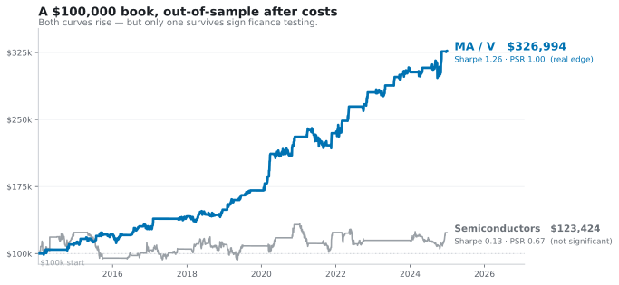

<div align="center">

# statarb-research

**Does cointegration pairs trading survive honest testing?**
**On semiconductors — no. On Mastercard/Visa — yes, with the statistics to prove it.**

[](https://github.com/saeedmohseni97/statarb-research/actions/workflows/ci.yml)
&nbsp;[](https://www.python.org/)
&nbsp;
&nbsp;[](https://statarb-research.streamlit.app)



### Sharpe 1.26 &nbsp;·&nbsp; +11.4%/yr &nbsp;·&nbsp; \$100k → \$327k &nbsp;·&nbsp; PSR ≈ 1.00 &nbsp;·&nbsp; profitable 11 / 11 years

📄&nbsp;**[Full report](report/statarb_report.pdf)** &nbsp;·&nbsp; 📓&nbsp;**[Results notebook](notebooks/06_results_real_data.ipynb)** &nbsp;·&nbsp; ▶&nbsp;**[Live dashboard](https://statarb-research.streamlit.app)**

<br>


&nbsp;
&nbsp;
&nbsp;
&nbsp;
&nbsp;
&nbsp;
&nbsp;

</div>

---

A reproducible pipeline for cointegration-based statistical arbitrage on US equities: pair screening,
signal construction, cost-aware walk-forward backtesting, and significance testing that accounts for
multiple comparisons and selection bias — so a reported edge can be told apart from luck.

## The idea in one minute

Two related stocks whose prices move together define a mean-reverting **spread**; you trade the spread
when it stretches and unwind when it snaps back. The catch is that most apparent edges are illusions —
look-ahead bias, ignored costs, or the simple fact that testing enough pairs guarantees a lucky winner.
This pipeline is built to expose that:

- **Screen** every pair for cointegration (Engle–Granger) with a **Benjamini–Hochberg FDR** correction.
- **Trade** the spread's z-score with mean-reversion half-life sizing, static **or** a Kalman dynamic hedge.
- **Backtest** walk-forward, out-of-sample, with transaction costs on every trade.
- **Judge** the result with a bootstrap Sharpe CI, the **Probabilistic Sharpe Ratio**, and the
  **Deflated Sharpe Ratio**, which penalizes for how many strategies were searched.

## Headline results (real data, 2013–2024)

| Universe | What the pipeline finds |
|---|---|
| **Semiconductors** | 0 of 210 pairs cointegrated after FDR; the best searched pair deflates to ≈0.2 (chance). No edge. |
| **Economic pairs** | **MA/V: Sharpe 1.26, +11.4%/yr, \$100k → \$327k, PSR ≈ 1.00, Deflated Sharpe ≈ 0.97, profitable every year.** |

The contrast is the point: a *blind* search over many pairs deflates to near-chance, while a
*pre-declared* economic pair (MA/V) survives every test. Distinguishing the two is the whole exercise.

<details>
<summary><b>Full results tables</b></summary>

<br>

**Semiconductors (20 names + SMH/SOXX):**

| Test | Result |
|------|--------|
| Engle–Granger screen + FDR | 0 of 210 significant after correction (10 at raw 5% ≈ the 10 expected by chance) |
| SMH / SOXX | 0.99 return correlation, but the spread is non-stationary → not cointegrated |
| AMAT/LRCX, static / Kalman (OOS) | Sharpe ≈ 0.13 / −0.12, not distinguishable from zero |
| Best of 210 searched pairs | Sharpe 0.54 vs a no-skill benchmark of 0.78 → Deflated Sharpe ≈ 0.21 |

**Economic pairs (14 names):**

| Test | Result |
|------|--------|
| Engle–Granger screen + FDR (91 pairs) | 2 survive FDR, but both are economically spurious (WMT vs. gold ETFs) |
| **MA/V, walk-forward OOS, after costs** | **Sharpe 1.26, +11.4%/yr, \$100k → \$327k, PSR ≈ 1.00, 95% CI [0.78, 1.79]** |
| MA/V robustness & deflation | Significant (PSR > 0.95) across the cost × entry grid; Deflated Sharpe ≈ 0.97 |

Full analysis with figures: [`notebooks/06_results_real_data.ipynb`](notebooks/06_results_real_data.ipynb).

</details>

## Dashboard

An interactive Streamlit app: switch universes, compare the static and Kalman hedges, screen every
pair, backtest with adjustable cost/entry bands, and inspect the significance results.

```bash
streamlit run app/streamlit_app.py
```

## Installation

```bash
pip install -r requirements.txt     # or: pip install -e ".[app]"
pytest -q                           # run the test suite
```

<details>
<summary><b>Repository structure</b></summary>

<br>

```
statarb/            core library
  config.py         universe definitions (parameters, not hardcoded logic)
  data.py           price download, caching, returns, alignment
  stats.py          ADF, Engle–Granger, FDR pair screen
  signals.py        hedge ratio, spread, half-life, z-score, entry/exit bands
  backtest.py       walk-forward PnL, turnover, costs, performance stats
  significance.py   bootstrap Sharpe CI, PSR, Deflated Sharpe
  kalman.py         Kalman-filter time-varying hedge
app/                Streamlit dashboard
scripts/            data-fetch utilities
notebooks/          analysis notebooks (00–06)
tests/              pytest suite (offline, deterministic)
data/               cached price CSVs
report/             write-up + figures
```

</details>

## Methods & references

- Engle & Granger (1987) — cointegration and error correction.
- Benjamini & Hochberg (1995) — false discovery rate control.
- Bailey & López de Prado (2014) — Probabilistic and Deflated Sharpe Ratios.
- Chan (2013) — Kalman-filter dynamic hedge for pairs trading.

---

## 👨‍💻 Author
**Saeed Mohseni seh deh**  
Graduate Researcher, Institute for Advanced Computing  
Virginia Tech, VA, USA  

🌐 [Website](https://saeedmohseni.netlify.app/) | 📫 saeedmohseni@vt.edu  

---

## 🌟 If you like this project...
⭐ [**Star** the repository](https://github.com/saeedmohseni97/statarb-research)  
🍴 [**Fork** it](https://github.com/saeedmohseni97/statarb-research/fork)  
🧠 [**Discuss** ideas or improvements](https://github.com/saeedmohseni97/statarb-research/issues)  

---

<sub>For research and educational purposes only. Nothing here is investment advice. Licensed under MIT.</sub>
